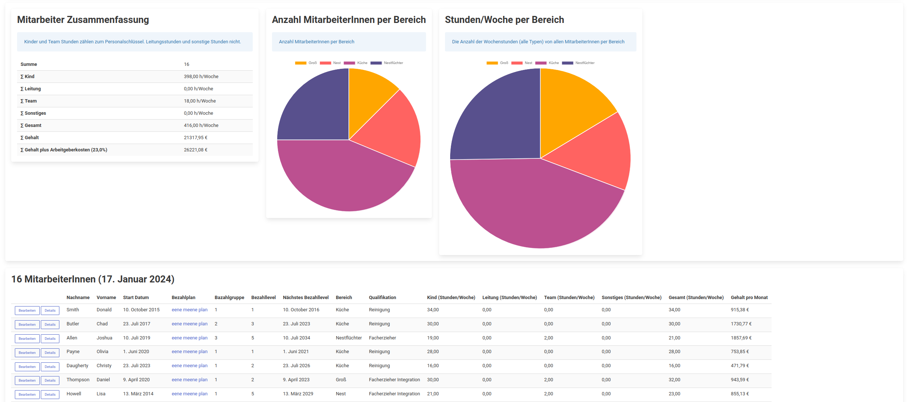
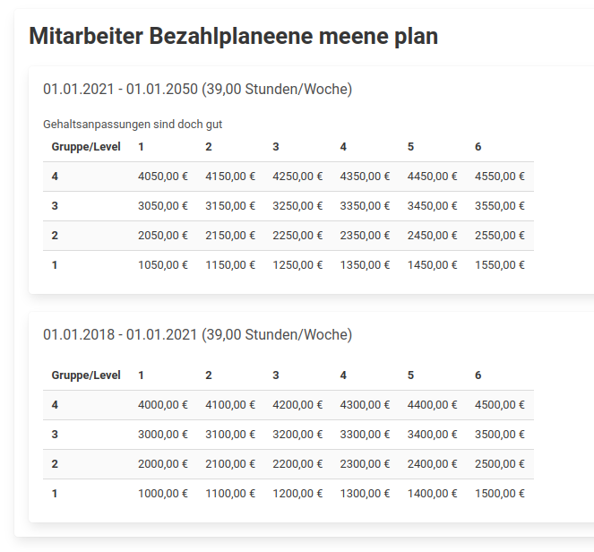
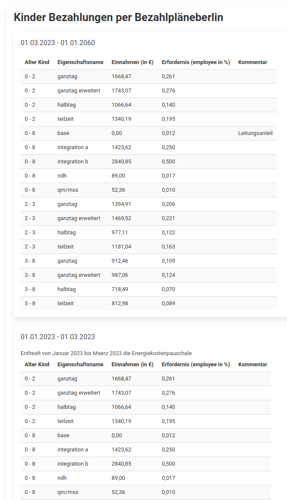
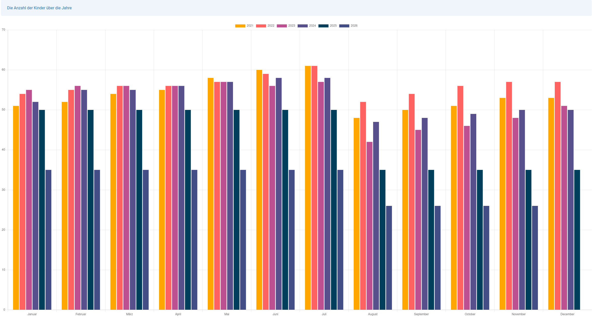
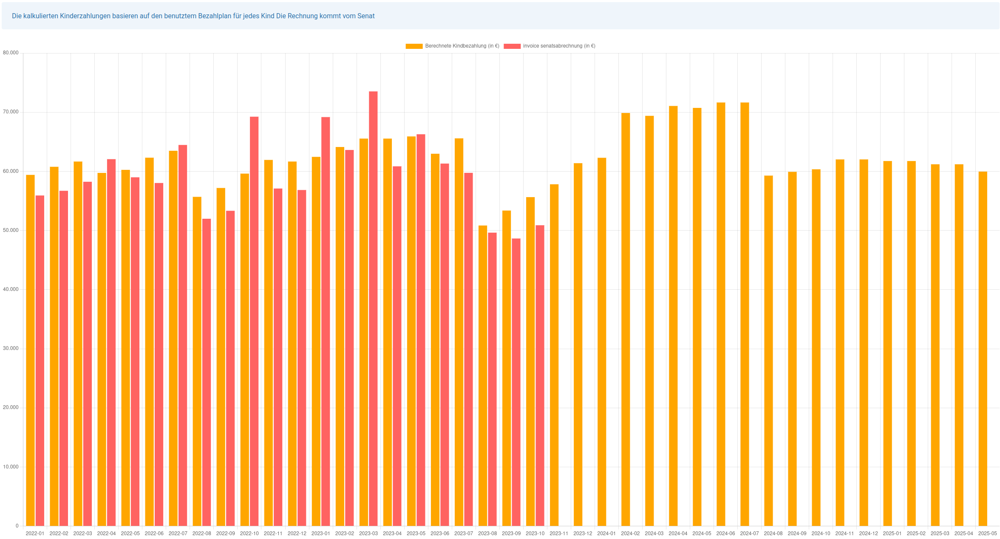

kitamanager - Software zur Verwaltung eines Kindergartens
=========================================================

`kitamanager` entstand aus einem Freizeitprojekt für die Eltern-Kinder-Tagesstätte
`eene meene mopel <http://www.eenemeene.de/>`_ um bei verschiedenen Aufgaben
der Vorstandsarbeit zu helfen. Die Software ist eine Web-Applikation
und kann auf einem eigenen Server oder in einer privaten oder öffentlichen Cloud
installiert werden.

Features
--------

`kitamanager` hat einige Features die helfen, die Kita am laufen zu halten.
Einige der Features sind Berlin spezifisch oder richten sich nach den
Bedürfnissen der Kita `eene meene mopel` aus.

Bereiche
~~~~~~~~

Es können verschiedene Bereiche definiert werden. Kinder und MitarbeiterInnen
werden diesen Bereichen zugeordnet. Ein Bereich wird als "educational" markiert,
wenn dort Kinder betreut werden. Nicht "educational" Bereiche sind zum Beispiel
die Küche.

MitarbeiterInnen
~~~~~~~~~~~~~~~~

MitarbeiterInnen haben Verträge welche sich über die Zeit ändern können.
Verträge haben unterschiedliche Eigenschaften (zB. Bereich, Bezahlplan, Bezahlgruppe
und Bezahllevel, Qualifikation und Arbeitsstunden unterteilt in unterschiedliche Aufgaben).

   Übersichtsseite der MitarbeiterInnen

MitarbeiterInnen Bezahlpläne
~~~~~~~~~~~~~~~~~~~~~~~~~~~~

Die Gehaltsstrukturen werden mittels Bezahlplänen abgebildet. Ein Bezahlplan ist
ähnlich zu einer Tariftabelle. Jeder Mitarbeiter ist einem Bezahlplan zugeordnet und
ist in einer Bezahlgruppe und einem Bezahllevel. Im Bezahlplan ist für jede Gruppe
und jedes Level ein Gehalt hinterlegt. Die Bezahlpläne können sich über die Zeit
ändern. Somit können Gehaltsanpassungen für alle MitarbeiterInnen vorgenommen werden.

   Beispiel Mitarbeiter Bezahlplan

Kinder
~~~~~~

Kinder haben (ähnlich wie Mitarbeiter) Verträge welche sich über die Zeit ändern können.
Jeder Vertrag hat unterschiedliche Eigenschaften (zB. Bereich, Bezahlplan, Bezahltags).
Bezahltags werden genutzt um die Einnahmen und Personalanforderungen für ein Kind abzubilden.
Bezahltags für Berlin sind zB. der Betreuungsumfang ("ganztags", "ganztags erweitert"),
Integrationsstatus und andere Besonderheiten welche zu einer unterschiedlichen Bezahlung führen.

   Beispiel Kinder Personalschlüssel und Bezahlplan

Statistiken
~~~~~~~~~~~

Es gibt unterschiedliche Statistiken. Hier ein paar Beispiele.

   Beispiel Kinderanzahl per Monat über verschiedene Jahre

   Beispiel Berechnete Einnahmen vs. reale Einnahmen vom Berliner Senat (mit Ausblick)

Und viele mehr.

.. toctree::
   :maxdepth: 2
   :caption: Contents:

   development
